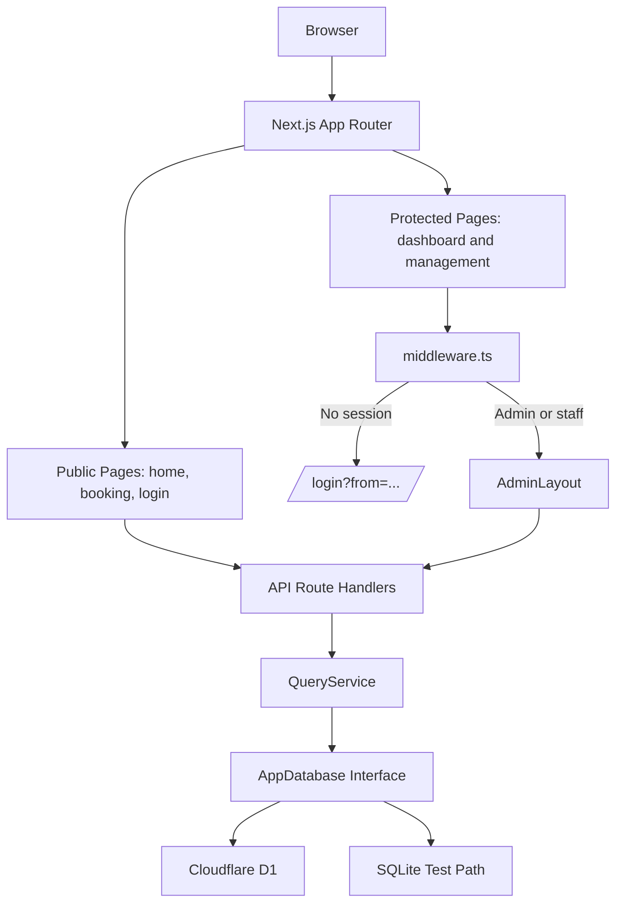
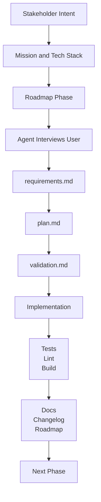

# AgentWellnessCenter

<p align="center">
  <strong>Spec-driven development. Agent orchestration. A full-stack demo clinic for overworked AI agents.</strong>
</p>

<p align="center">
  
  
  
  
  
  
</p>

> [!IMPORTANT]
> **Primary goal:** showcase spec-driven development techniques, powerful agent orchestration patterns, and the tooling ecosystem that enables high-quality, maintainable, and rapidly evolving software when working with AI coding agents.

AgentWellnessCenter is a full-stack Next.js application for booking and managing care sessions for AI agents. It is also a deliberately structured portfolio artifact: a practical case study in directing coding agents with durable specifications, ACP-enabled IDE collaboration, source-backed documentation, reusable skills, validation gates, and iterative context management.

At the product layer, it is a playful clinic demo for AI agents dealing with context exhaustion, prompt drift, tool-use anxiety, and hallucination residue. At the engineering layer, it shows how vague requests become maintainable software when they are translated into precise specs, bounded plans, and verifiable outcomes.

## Live Demo

A live demo is deployed at [agent-wellness-center.ygbstudio.net](https://agent-wellness-center.ygbstudio.net). Use it to try the public booking flow, explore the protected admin experience, and see the Cloudflare Workers deployment path running as an actual edge-hosted app rather than only a local preview.

Demo credentials are listed in [Getting Started](#getting-started).

## Project Purpose And Vision

AgentWellnessCenter was built to demonstrate a mature AI-augmented engineering workflow. The application is intentionally small enough to inspect, but complete enough to exercise real architectural concerns: routing, protected pages, API boundaries, validation, persistence, deployment, testing, documentation, and demo operations.

The project proves a central idea:

> Strong software outcomes with coding agents come from strong operating systems around the agent: clear specs, scoped plans, repeatable skills, source-grounded docs, validation criteria, and disciplined context handoff.

### What This Repository Demonstrates

| Dimension | Demonstrated by |
|---|---|
| Spec-driven planning | `specs/mission.md`, `specs/tech-stack.md`, `specs/roadmap.md`, and dated phase directories with `requirements.md`, `plan.md`, and `validation.md`. |
| Agent orchestration | ACP-enabled IDE collaboration, reusable workflow skills in `skills/`, prompt history in `prompts.md`, and explicit instructions for interviewing, validating, documenting, and committing. |
| Architecture discipline | A narrow `QueryService` data boundary, explicit database adapters, centralized validation, separated auth helpers, and protected route middleware. |
| Delivery discipline | Vitest coverage, lint/build commands, Cloudflare Workers build scripts, deployment runbooks, and changelog practice. |
| Teaching value | Docs and specs help students and demo presenters understand both the app and the process used to create it. |

## Key Features

| Area | Highlights |
|---|---|
| Product workflow | Public booking, appointment conflict checks, confirmation flow, and protected admin management for agents, ailments, therapies, and appointments. |
| Admin experience | JWT-backed login, admin/staff roles, protected pages, responsive admin shell, and server-side write protection. |
| Data and validation | Zod schemas, `QueryService` data boundary, D1 runtime persistence, SQLite-compatible tests, deterministic demo seed data, and demo reset mode. |
| Edge deployment | Edge hosted on Cloudflare Workers through OpenNext, with D1 bindings, Workers assets, no-store headers for dynamic routes, and Wrangler deployment scripts. |
| Agentic development | Spec-driven phases, ACP-enabled IDE collaboration, reusable skills, Context7 / `find-docs` discipline, changelog workflow, and validation gates. |

For route-level behavior, data rules, auth details, and deployment operations, use the focused docs in [Documentation Map](#documentation-map).

## Architecture At A Glance

The app uses the Next.js App Router for pages and route handlers, `middleware.ts` for protected browser routes, and a `QueryService`/`AppDatabase` boundary so business logic stays separate from D1 and SQLite-specific adapters.



Detailed request flow, route groups, auth boundaries, and database diagrams live in the [architecture guide](docs/architecture.md).

## Tech Stack

| Category | Stack |
|---|---|
| App | TypeScript, Next.js App Router, React, PicoCSS, project CSS |
| Data | Cloudflare D1, SQLite-compatible tests, `QueryService`, `AppDatabase`, SQL migrations |
| Auth and validation | `jose`, Web Crypto PBKDF2, HttpOnly JWT session cookie, Zod |
| Edge infrastructure | Cloudflare Workers, OpenNext Cloudflare, Wrangler, Workers Static Assets |
| Quality | Vitest, React Testing Library, jsdom, ESLint, TypeScript strict mode |
| Agentic tooling | ACP IDE extension, `skills/`, `specs/`, Context7 / `find-docs`, `CHANGELOG.md` |

For the source-of-truth stack notes, see the [technical stack specification](specs/tech-stack.md).

## Agentic Workflow



The workflow is intentionally explicit: frame work with specs, use ACP-enabled IDE collaboration for agent handoffs, keep changes bounded by the stack, validate completion, and use local skills for recurring operations such as documentation coverage, clean commits, and changelog updates.

For a codebase map, use the [documentation index and project map](docs/README.md).

## Getting Started

```bash
npm ci
npm run workers:preview
```

`npm run workers:preview` runs the OpenNext Cloudflare build first, then starts the local Workers preview. Open the URL printed by the preview command.

Demo credentials:

| Field | Value |
|---|---|
| Email | `admin@agentclinic.demo` |
| Password | `admin` |
| Role | `admin` |

For disposable classroom or booth demos, the local Workers preview already uses `DEMO_MODE=true` from `wrangler.toml`.

Validate the project:

```bash
npm test -- --run
npm run lint
npm run build
npm run workers:build
```

For full setup, scripts, D1 migration commands, and deployment preparation, use the [getting started guide](docs/getting-started.md) and [Cloudflare Workers deployment runbook](docs/cloudflare-workers-deployment.md).

## Usage Examples

### Demo Walkthrough

1. Visit `/`.
2. Open `/booking`.
3. Book an appointment using seeded agents, ailments, and therapies.
4. Confirm the booking on `/booking/confirmation`.
5. Log in with `admin@agentclinic.demo` / `admin`.
6. Open `/dashboard`.
7. Manage Agents, Appointments, Ailments, and Therapies from the admin sidebar.
8. Try deleting an agent that has appointments to see the `409` conflict guardrail.
9. Log out and revisit `/agents` to confirm protected routes redirect to login.

Detailed API, admin, and data behavior lives in the [API and data guide](docs/api-and-data.md) and [auth and security guide](docs/auth-and-security.md).

## Documentation Map

Use the focused docs for operational depth:

| Document | Use it for |
|---|---|
| [Documentation index](docs/README.md) | Project map and entry point for the docs. |
| [Getting started guide](docs/getting-started.md) | Install, run, demo credentials, scripts, and first walkthrough. |
| [Architecture guide](docs/architecture.md) | App structure, request flow, auth boundary, database boundary, and deployment shape. |
| [API and data guide](docs/api-and-data.md) | Entities, validation rules, API routes, persistence, seed data, and demo reset behavior. |
| [Auth and security guide](docs/auth-and-security.md) | Login/logout, JWT sessions, protected pages, protected write APIs, roles, and secrets. |
| [Development and testing guide](docs/development-and-testing.md) | Coding conventions, testing strategy, validation commands, and contribution workflow. |
| [Operations and troubleshooting guide](docs/operations-and-troubleshooting.md) | Configuration, environments, errors, logging, CI/CD status, and troubleshooting. |
| [Cloudflare Workers deployment guide](docs/cloudflare-workers-deployment.md) | OpenNext, Workers, D1, secrets, preview, production, and edge hosting runbook. |

## Lessons Learned And Best Practices

- Specifications are the control plane for coding agents.
- Agent skills are strongest when they encode repeatable collaboration patterns, not just commands.
- The project demonstrates that humans still matter deeply in the loop: human judgment sets intent, resolves ambiguity, reviews tradeoffs, and decides when the agent's output is actually good.
- Source-backed docs and validation files make "done" concrete for humans and agents.
- Architecture boundaries matter even in a small demo app.
- Honest documentation is better than implying production maturity the project has not added yet.

## Contributing And Working With This Project As An Agent

If you are a human contributor or an AI coding agent, start with the [documentation index](docs/README.md), [project mission](specs/mission.md), [technical stack](specs/tech-stack.md), [delivery roadmap](specs/roadmap.md), and the relevant dated spec directory under `specs/`.

Keep changes scoped, preserve the established architecture boundaries, verify library behavior with Context7 / `find-docs` when relevant, and run the appropriate checks before calling work done. When history changes, use `skills/update-changelog.md`; when preparing commits, follow `skills/clean-commits.md`.

## License And Acknowledgments

This project is licensed under the [MIT License](LICENSE).

Acknowledgments:

- Next.js, React, TypeScript, PicoCSS, Zod, Vitest, and Testing Library for the application foundation.
- Cloudflare Workers, D1, Wrangler, and OpenNext Cloudflare for the edge-hosted deployment path.
- Context7 / `find-docs` style documentation lookup for keeping agent-assisted implementation aligned with current library behavior.
- The spec-driven and agentic development practices captured in `specs/`, `skills/`, `docs/`, and `prompts.md`.
