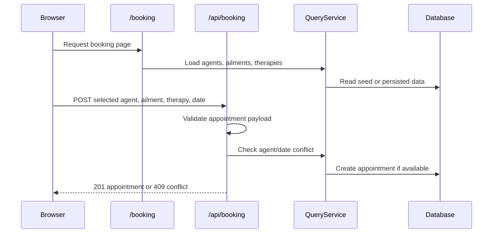

# API And Data

Agent Wellness Center uses simple relational data for users, agents, ailments, therapies, and appointments. Route handlers validate request bodies with Zod and persist through `QueryService`.

## Entities

| Entity | Fields | Notes |
|---|---|---|
| User | `id`, `email`, `password_hash`, `role`, `created_at` | Roles are `admin` or `staff`. |
| Agent | `id`, `name`, `type`, `created_at` | Agent names are unique. |
| Ailment | `id`, `name`, `description`, `severity`, `created_at` | Severity is validated as `low`, `medium`, `high`, or `critical`. |
| Therapy | `id`, `name`, `description`, `duration`, `created_at` | Duration is stored in minutes. |
| Appointment | `id`, `agent_id`, `ailment_id`, `therapy_id`, `date`, `status`, `created_at` | Foreign keys connect appointments to agents, ailments, and therapies. |

The schema source is `lib/db/schema.ts`, mirrored by `migrations/0001_initial.sql` for D1 migrations.

## Validation Rules

Validation lives in `lib/validation.ts`.

| Payload | Key rules |
|---|---|
| Agent create/update | `name` required on create, max 200 chars. `type` required on create, max 100 chars. |
| Ailment create/update | `name` max 200 chars, `description` max 2000 chars, `severity` must be one of the severity enum values. |
| Therapy create/update | `name` max 200 chars, `description` max 2000 chars, `duration` must be an integer from 1 to 1440. |
| Appointment create/update | Foreign key IDs must be positive integers, `date` is required on create, `status` must be a valid appointment status. |

Appointment statuses are `scheduled`, `confirmed`, `in-progress`, `completed`, and `cancelled`.

## API Routes

| Route | Methods | Auth | Purpose |
|---|---|---|---|
| `/api/agents` | `GET`, `POST` | `GET` public, `POST` admin/staff | List and create agents. |
| `/api/agents/[id]` | `GET`, `PUT`, `DELETE` | `GET` public, writes admin/staff | Read, update, or delete one agent. |
| `/api/ailments` | `GET`, `POST` | `GET` public, `POST` admin/staff | List and create ailments. |
| `/api/ailments/[id]` | `GET`, `PUT`, `DELETE` | `GET` public, writes admin/staff | Read, update, or delete one ailment. |
| `/api/therapies` | `GET`, `POST` | `GET` public, `POST` admin/staff | List and create therapies. |
| `/api/therapies/[id]` | `GET`, `PUT`, `DELETE` | `GET` public, writes admin/staff | Read, update, or delete one therapy. |
| `/api/appointments` | `GET`, `POST` | `GET` public, `POST` admin/staff | List appointments, filter by `agentId`, or create an appointment. |
| `/api/appointments/[id]` | `GET`, `PUT`, `DELETE` | `GET` public, writes admin/staff | Read, update, or delete one appointment. |
| `/api/booking` | `POST` | Public | Create a public booking with conflict checking. |
| `/api/auth/login` | `POST` | Public | Validate credentials and set the session cookie. |
| `/api/auth/logout` | `POST` | Session optional | Clear the session cookie and reset demo data when applicable. |
| `/api/auth/me` | `GET` | Session required | Return the authenticated user profile. |
| `/api/demo/reset` | `POST` | Admin/staff | Reset seeded demo data when `DEMO_MODE=true`. |

All route handlers export `dynamic = 'force-dynamic'` so runtime data is not treated as static build output.

## Booking Flow



The public booking endpoint defaults missing status to `scheduled` and rejects a time slot when the selected agent already has a non-cancelled appointment at the same date.

## Persistence

`QueryService` owns the SQL used by the application. It is backed by an `AppDatabase` interface with methods for `first`, `all`, `run`, and `exec`.

Runtime deployments use `D1DatabaseAdapter` and the Cloudflare `DB` binding. Local unit tests and portable data experiments can use SQLite through the existing SQLite path.

The D1 adapter initializes schema and demo seed data on first database access. Explicit migrations are also available:

```bash
npm run d1:migrate:local
npm run d1:migrate:preview
npm run d1:migrate:production
```

## Demo Seed And Reset

`lib/db/seed.ts` creates:

- The demo admin user `admin@agentclinic.demo` with password `admin`.
- Four demo agents.
- Four demo ailments.
- Four demo therapies.
- Three demo appointments.

When `DEMO_MODE=true`, logout and authenticated demo reset requests can restore the deterministic demo data. Production uses `DEMO_MODE=false` in `wrangler.toml`.

## Delete Safety

Agents, ailments, and therapies cannot be deleted while existing appointments reference them. The API returns `409` for those cases so demo users see a clear conflict instead of silently breaking appointment history.
