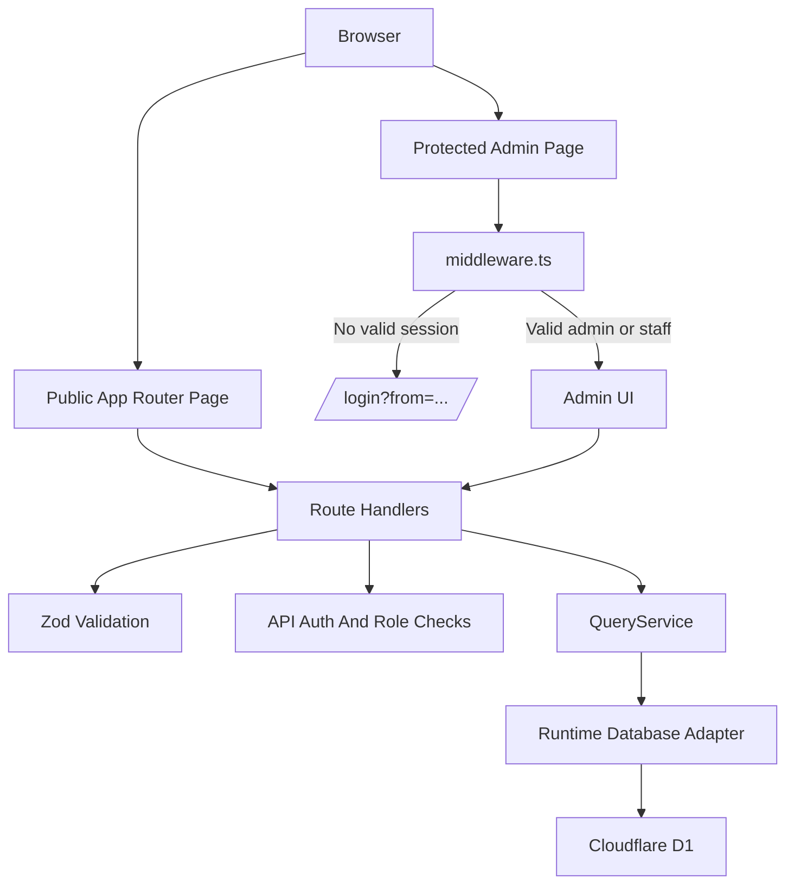
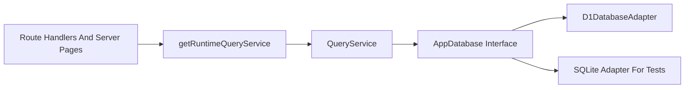

# Architecture

Agent Wellness Center is a dynamic Next.js App Router application deployed to Cloudflare Workers through OpenNext. It uses public pages for booking and protected admin pages for clinic management.

## Application Shape

| Layer | Responsibility | Key files |
|---|---|---|
| App Router pages | Public home, booking, login, dashboard, and management screens. | `app/` |
| Client components | Forms, auth context, responsive navigation, admin layout interactions. | `app/**`, `components/`, `lib/auth/context.tsx` |
| Route handlers | JSON APIs for auth, booking, CRUD, and demo reset. | `app/api/` |
| Auth middleware | Browser route protection and API role checks. | `middleware.ts`, `lib/auth/middleware.ts` |
| Query service | Application data operations independent of a concrete database. | `lib/services/queryService.ts` |
| Database adapters | D1 for runtime, SQLite for local unit tests and portable experiments. | `lib/db/` |
| Validation | Zod schemas for API inputs. | `lib/validation.ts` |
| Deployment config | OpenNext and Cloudflare Workers settings. | `open-next.config.ts`, `wrangler.toml`, `next.config.js` |

## Route Groups

| Route | Audience | Notes |
|---|---|---|
| `/` | Public visitors | Marketing-style home page for the demo clinic. |
| `/booking` | Public visitors | Loads agents, ailments, and therapies, then posts appointments to `/api/booking`. |
| `/booking/confirmation` | Public visitors | Shows appointment confirmation details from query parameters. |
| `/login` | Staff and admins | Authenticates against seeded or database-backed users. |
| `/dashboard` | Staff and admins | Protected overview with entity counts. |
| `/agents`, `/ailments`, `/therapies`, `/appointments` | Staff and admins | Protected management pages with CRUD flows. |
| `/access-denied` | Authenticated users without access | Used by middleware for role failures. |

## Request Flow

In text: browser requests go through public pages or protected pages. Protected browser pages are checked by `middleware.ts`. APIs validate inputs, enforce auth for protected writes, call `QueryService`, and persist data through the runtime database adapter.

## Database Boundary

The application talks to data through `QueryService`, which depends on the `AppDatabase` interface rather than a specific database implementation.

Production and preview use Cloudflare D1 through `getCloudflareContext()`. Tests can use SQLite-compatible adapters without changing route or service logic.

## Runtime And Deployment

The active deployment target is Cloudflare Workers:

- `open-next.config.ts` uses `defineCloudflareConfig()`.
- `wrangler.toml` points the Worker entry to `.open-next/worker.js`.
- Static assets are served from `.open-next/assets` through the `ASSETS` binding.
- D1 is exposed through the `DB` binding.
- `nodejs_compat` is enabled for the Worker.
- `next.config.js` sets `Cache-Control: no-store` for APIs, auth, protected pages, and management pages.

For full deployment steps, use [Cloudflare Workers Deployment](cloudflare-workers-deployment.md).

## Auth Boundary

Browser protection and API protection are intentionally separate:

- Browser page protection lives in `middleware.ts`.
- API write protection uses `requireRole()` from `lib/auth/middleware.ts`.
- Public reads are available for core data routes because the booking flow needs agents, ailments, and therapies.
- Protected writes return `401` when unauthenticated and `403` when authenticated without an allowed role.

Read [Auth And Security](auth-and-security.md) for the full auth flow.

## State Management

The app keeps auth state in `AuthProvider` from `lib/auth/context.tsx`. The provider checks `/api/auth/me` on load, hydrates state from the login response after sign-in, and exposes `login()` and `logout()`.

Most domain data is loaded server-side through `getRuntimeQueryService()` and refreshed through route navigation or client form submissions.
