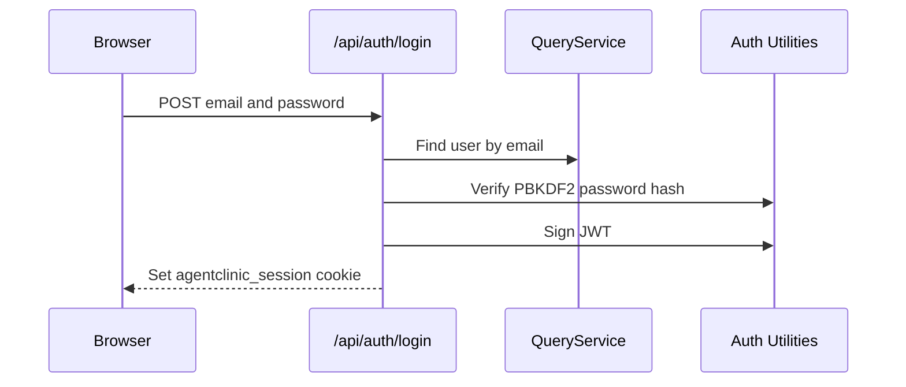

# Auth And Security

Agent Wellness Center uses a small role-based auth system for the demo clinic. The public booking flow remains open, while dashboard and management workflows require an authenticated `admin` or `staff` user.

## Roles

| Role | Current access |
|---|---|
| `admin` | Dashboard, management pages, protected write APIs, demo reset. |
| `staff` | Same access as admin in the current MVP. |

The role model is intentionally simple for the MVP. The code already keeps role checks centralized so future phases can split admin-only and staff-only behavior.

## Login Flow



Passwords are stored as PBKDF2 SHA-256 hashes with a per-password salt. JWTs are signed with HS256 through `jose`.

## Session Cookie

The session cookie is named `agentclinic_session`.

Login sets the cookie with:

- `HttpOnly`
- `SameSite=Strict`
- `Path=/`
- Seven day max age
- `Secure` when `NODE_ENV=production`

Logout clears the cookie. In demo mode, logout also attempts to reset the demo database for authenticated admin or staff users.

## Browser Route Protection

`middleware.ts` protects these page routes:

- `/dashboard`
- `/agents`
- `/ailments`
- `/therapies`
- `/appointments`

Unauthenticated users are redirected to `/login?from=<path>`. Authenticated users with the wrong role are redirected to `/access-denied`.

The middleware skips API routes. API routes enforce their own auth rules.

## API Protection

Protected write APIs call `requireRole()` from `lib/auth/middleware.ts`.

Expected API auth responses:

| Situation | Response |
|---|---|
| Missing or invalid session on protected write | `401` with `Authentication required` |
| Authenticated user without an allowed role | `403` with `Insufficient permissions` |
| Invalid input payload | `400` with validation error text |
| Referenced protected record cannot be deleted safely | `409` conflict |

Public read APIs are available because the booking flow needs to load agents, ailments, and therapies before a visitor logs in.

## JWT Secret Behavior

`JWT_SECRET` signs and verifies sessions. A local demo fallback secret exists for development convenience only.

`REQUIRE_JWT_SECRET=true` prevents preview and production from using the fallback secret. In `wrangler.toml`, preview and production set `REQUIRE_JWT_SECRET` to `true`.

Set preview and production secrets with Wrangler:

```bash
wrangler secret put JWT_SECRET --env preview
wrangler secret put JWT_SECRET --env production
```

Do not commit real secrets.

## Demo Credentials

The seeded demo admin account is:

| Field | Value |
|---|---|
| Email | `admin@agentclinic.demo` |
| Password | `admin` |
| Role | `admin` |

Use this for classroom and conference demos. Do not treat it as a production credential.

## Security Notes For Maintainers

- Keep auth checks server-side for protected writes.
- Keep sensitive or user-specific responses uncached. `next.config.js` applies `Cache-Control: no-store` to API, login, dashboard, and management routes.
- Keep demo mode disabled in production with `DEMO_MODE=false`.
- Rotate `JWT_SECRET` if a preview or production secret is exposed.
- Add stricter role separation only when the product needs distinct admin and staff permissions.
